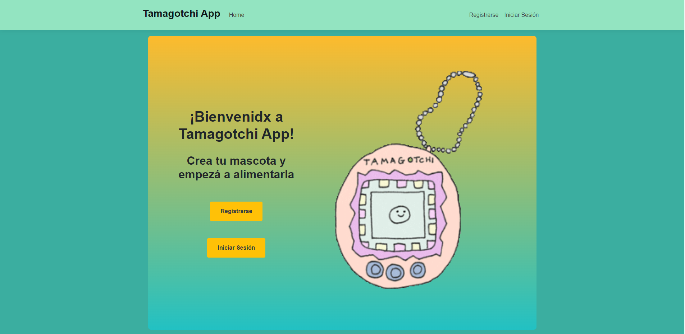

# Tamagotchi APP

Este es un proyecto inspirado en el famoso juego tamagotchi donde el usuario puede tener una o varias mascotas virtuales que debe cuidar adecuadamente.

## Características principales
 - El usuario puede crear una cuenta o iniciar sesión si ya tiene una.
 - Una vez autenticado, el usuario puede crear y mantener varias mascotas.
 - Cada mascota tiene diferentes necesidades, como hambre y felicidad.
 - El usuario debe alimentar a las mascotas para mantener su nivel de hambre bajo control y su felicidad alta.
 - La aplicación muestra una interfaz visual atractiva con la mascota y sus indicadores de estado.
 - Tambien podrás visualizar tus estadisticas y las de tus mascotas 
   
## Tecnologías utilizadas
 - C#: Lenguaje de programación utilizado para desarrollar la aplicación.
 - .NET Core: Framework utilizado para el desarrollo y ejecución de la aplicación.
 - MySQL: Base de datos utilizada para almacenar la información de las mascotas y los usuarios.
